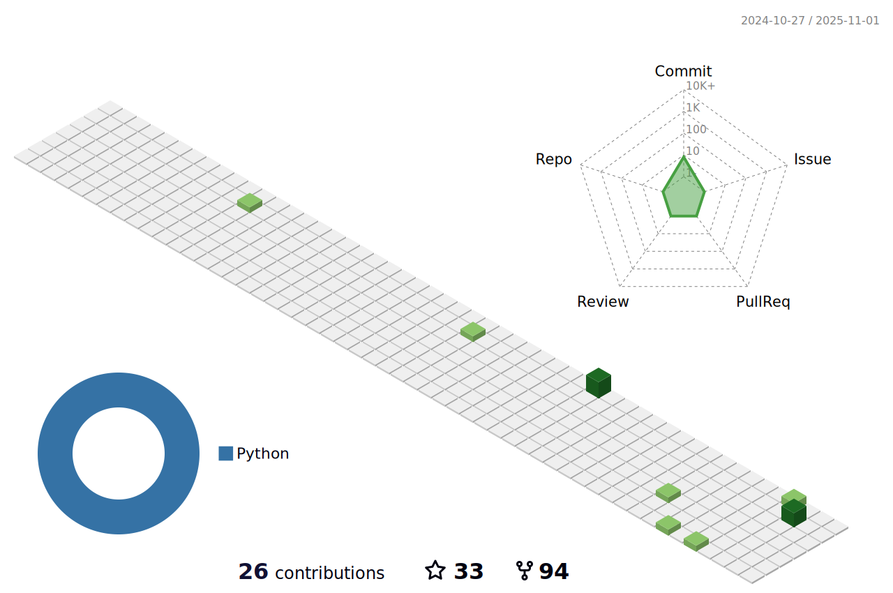

### Hi there, I'm Salah Assana 👋

I am a Artificial Intelligence and Healthcare enthusiast with a background in machine learning, signal processing and medical imaging. I have worked as a Research Assistant (RA) since 2015 at several laboratories including [UVA Link Lab](https://engineering.virginia.edu/link-lab), [MIT Media Lab](https://www.media.mit.edu/) and [HMS Cardiac MR Center](https://cardiacmr.hms.harvard.edu/). My work has been published to several journals and conferences including JMRI, MRM, Radiology, ISMRM, MobiCom, and UbiComp.

<!--  -->

## &#x270d; Blog & Writing

Apart from being an Open Source'rer, I also write on [Medium](https://medium.com/) and [DEV.to](https://dev.to/) platforms. Please, be free to follow my work there. Hope to help you!

## &#x1f4c8; GitHub Stats

## &#x1f4c9; GitHub Profile Contributions

## Contributed Repositories

<!-- ## &#x1f4c9; CodersRank Stats

 -->
